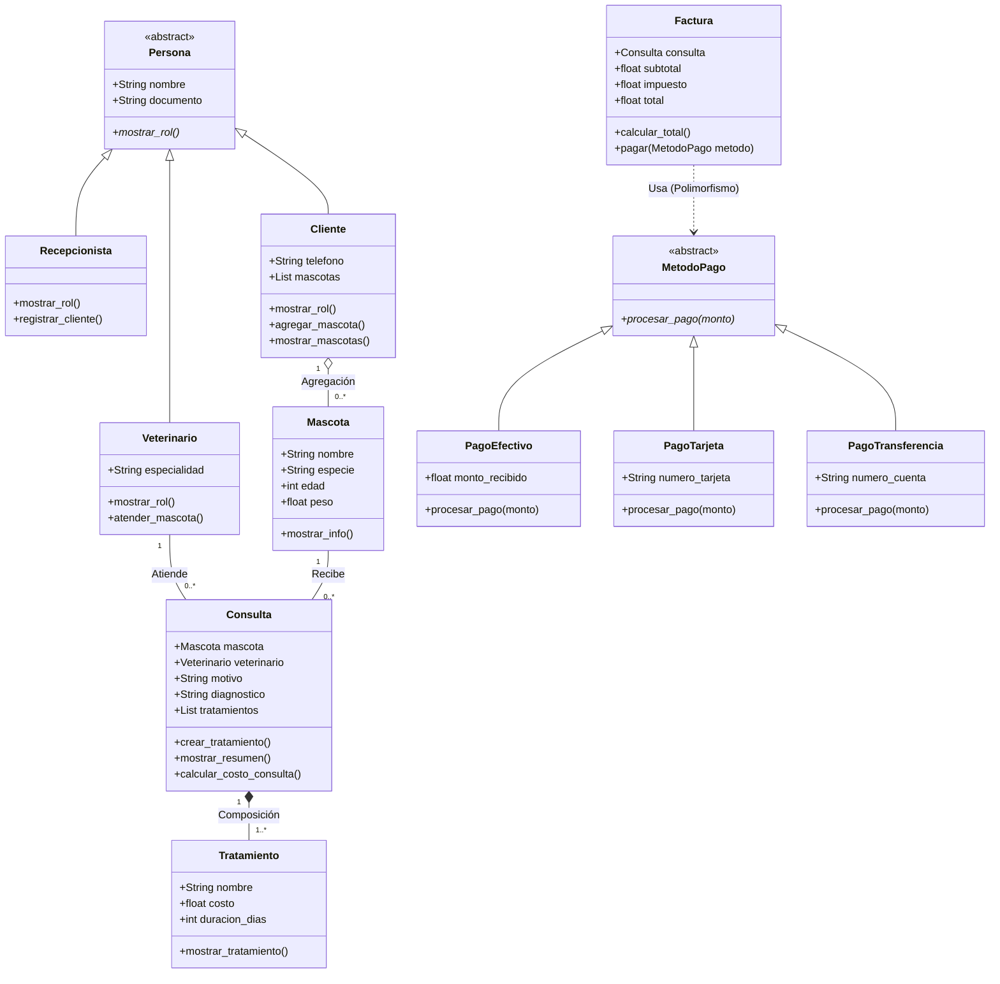

```mermaid
classDiagram
    %% 1. Herencia y Clase Abstracta
    class Persona {
        <<abstract>>
        +String nombre
        +String documento
        +mostrar_rol()*
    }
    Persona <|-- Veterinario
    Persona <|-- Recepcionista
    Persona <|-- Cliente

    class Veterinario {
        +String especialidad
        +mostrar_rol()
        +atender_mascota()
    }

    class Recepcionista {
        +mostrar_rol()
        +registrar_cliente()
    }

    class Cliente {
        +String telefono
        +List mascotas
        +mostrar_rol()
        +agregar_mascota()
        +mostrar_mascotas()
    }

    %% 4. Agregación (Cliente tiene Mascotas)
    Cliente "1" o-- "0..*" Mascota : Agregación

    class Mascota {
        +String nombre
        +String especie
        +int edad
        +float peso
        +mostrar_info()
    }

    %% 3. Asociación (Consulta conecta Veterinario y Mascota)
    class Consulta {
        +Mascota mascota
        +Veterinario veterinario
        +String motivo
        +String diagnostico
        +List tratamientos
        +crear_tratamiento()
        +mostrar_resumen()
        +calcular_costo_consulta()
    }
    Veterinario "1" -- "0..*" Consulta : Atiende
    Mascota "1" -- "0..*" Consulta : Recibe

    %% 5. Composición (Consulta crea Tratamientos)
    Consulta "1" *-- "1..*" Tratamiento : Composición

    class Tratamiento {
        +String nombre
        +float costo
        +int duracion_dias
        +mostrar_tratamiento()
    }

    %% 6. Polimorfismo y Factura
    class MetodoPago {
        <<abstract>>
        +procesar_pago(monto)*
    }
    MetodoPago <|-- PagoEfectivo
    MetodoPago <|-- PagoTarjeta
    MetodoPago <|-- PagoTransferencia

    class PagoEfectivo {
        +float monto_recibido
        +procesar_pago(monto)
    }

    class PagoTarjeta {
        +String numero_tarjeta
        +procesar_pago(monto)
    }

    class PagoTransferencia {
        +String numero_cuenta
        +procesar_pago(monto)
    }

    class Factura {
        +Consulta consulta
        +float subtotal
        +float impuesto
        +float total
        +calcular_total()
        +pagar(MetodoPago metodo)
    }
    Factura ..> MetodoPago : Usa (Polimorfismo)
```